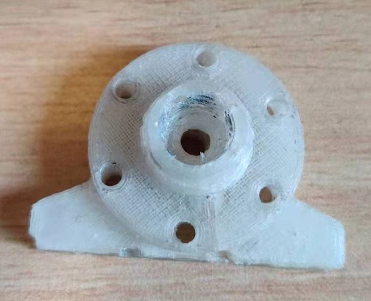

# z-probe - Kossel delta z校正调平传感器

## 调平测试视频
- 

## 电路

## 安装
打印下面的打印件，按照安装图
### 打印件
- [底座-蓝](./printed_parts/kossel%20E3D%20mount/Z%20PROBE%20-%20piezo%20mount-bottom.stl)
- [上盖-绿](./printed_parts/kossel%20E3D%20mount/Z%20PROBE%20-%20piezo%20mount-up.stl)
- [活动件-黄](./printed_parts/kossel%20E3D%20mount/Z%20PROBE%20-%20piezo%20mount-touch.stl)
### 组装步骤

### 安装效果图

## 电路
- Gerber文件在 [Gerber](./Gerber/) 目录
- 电路
  - 
## 安装
打印下面的打印件，按照安装图
### 打印件
- [底座-蓝](./printed_parts/kossel%20E3D%20mount/Z%20PROBE%20-%20piezo%20mount-bottom.stl)
- [上盖-绿](./printed_parts/kossel%20E3D%20mount/Z%20PROBE%20-%20piezo%20mount-up.stl)
- [活动件-黄](./printed_parts/kossel%20E3D%20mount/Z%20PROBE%20-%20piezo%20mount-touch.stl)
### 组装步骤
- step 1
  - 
- step 2
  - 
- step 3
  - 
- step 4
  - 

### 安装效果图 
- up corner view
  - 
- bottom corner view
  - 
- 实际图
  - 
