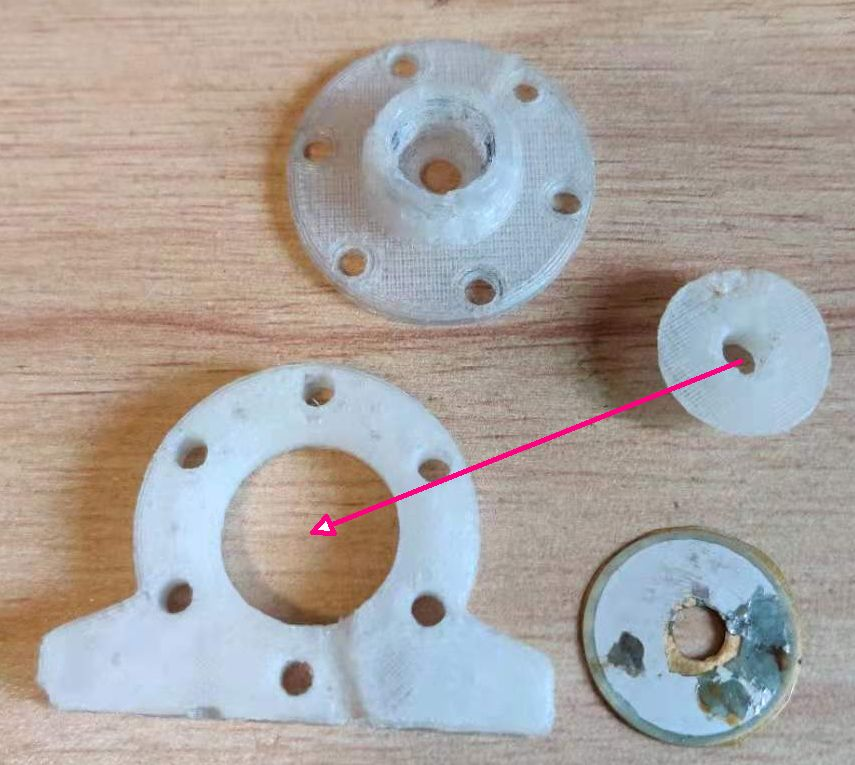
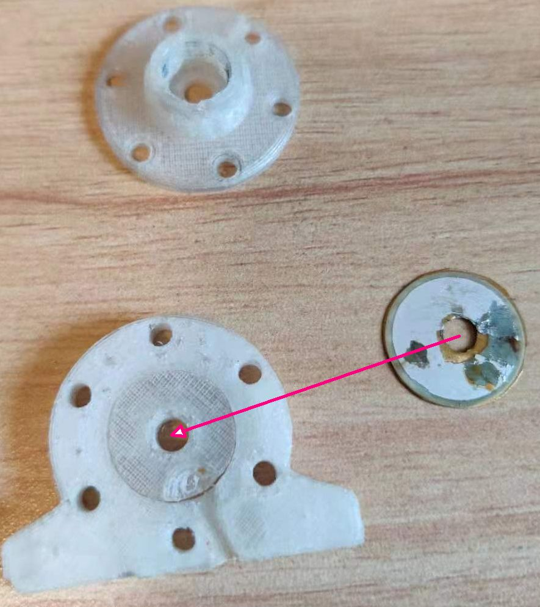
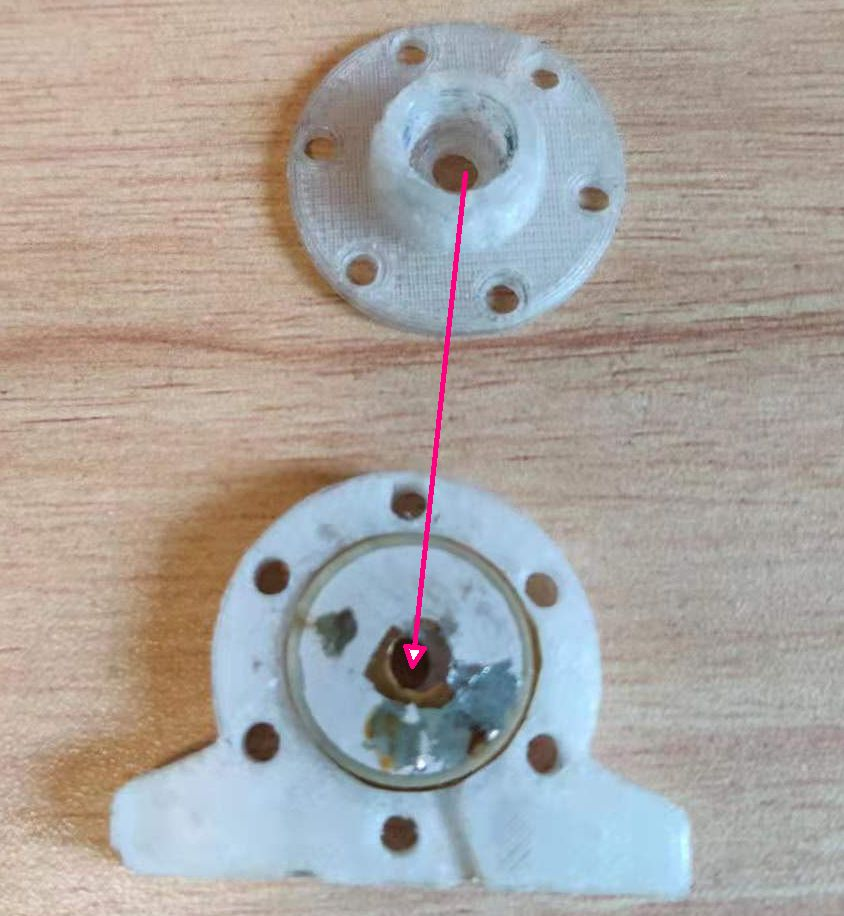
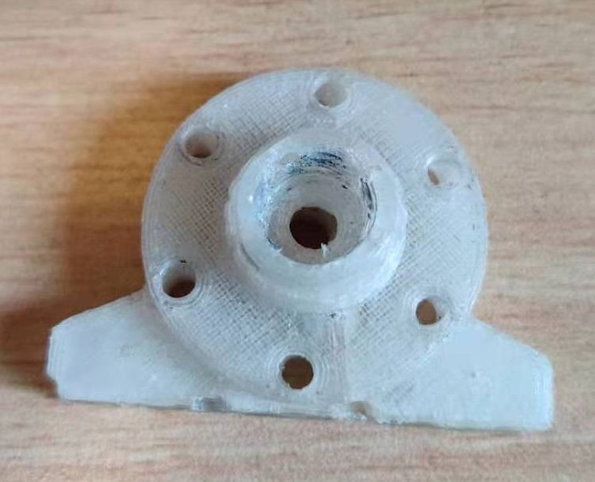
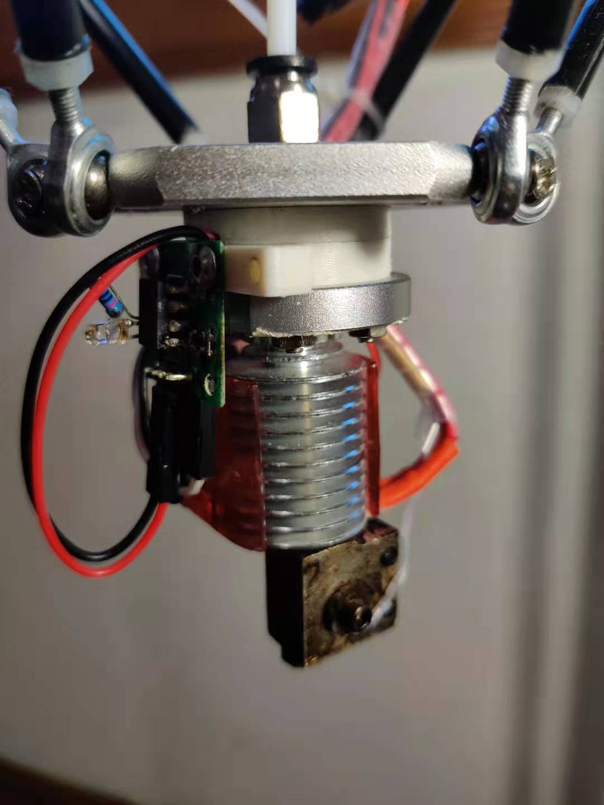

[中文](./README-cn.md)
# piezo_probe_kossel
Piezo z probe for kossel 3d printer
## Testing Video
- 

# Z-probe - sensor for Kossel delta calibration and level mesh
## Schematics
- Gerber files is under [Gerber](./Gerber/) directory
- Schematic
  - 
## Assembly
Print the parts below, and assemble follow the instructions.
### Printed parts
- [bottom-blue](./printed_parts/kossel%20E3D%20mount/Z%20PROBE%20-%20piezo%20mount-bottom.stl)
- [up-green](./printed_parts/kossel%20E3D%20mount/Z%20PROBE%20-%20piezo%20mount-up.stl)
- [touch-yellow](./printed_parts/kossel%20E3D%20mount/Z%20PROBE%20-%20piezo%20mount-touch.stl)
### Assemble instuctions
- step 1
  - 
- step 2
  - 
- step 3
  - 
- step 4
  - 

### View as a whole 
- up corner view
  - 
- bottom corner view
  - 
- mounted view
  - 
